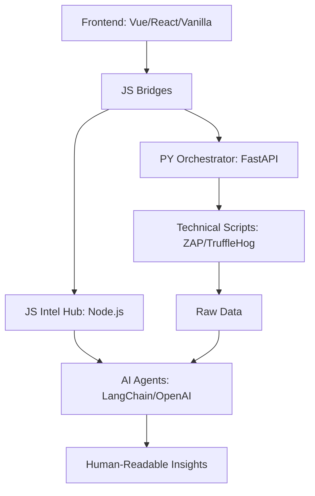

# 🛡️ Super App Security Kit (SASK)
> **Securing the Future of Fintech Ecosystems.**

[](https://www.python.org/downloads/)
[](https://opensource.org/licenses/MIT)
[](#)
[](#)

---

## 📖 Tabla de Contenidos
- [Introducción](#-introducción)
- [El Desafío del Mercado](#-el-desafío-del-mercado)
- [Nuestra Propuesta de Valor](#-nuestra-propuesta-de-valor)
- [Módulos del Kit](#-módulos-del-kit)
- [Arquitectura Técnica](#-arquitectura-técnica)
- [Mapeo de Cumplimiento (Compliance)](#-mapeo-de-cumplimiento-compliance)
- [Guía de Inicio Rápido](#-guía-de-inicio-rápido)
- [Roadmap de Desarrollo](#-roadmap-de-desarrollo)

---

## 🌟 Introducción
Las **Super Apps** financieras no son solo aplicaciones; son ecosistemas complejos que integran pagos, préstamos, inversiones y datos personales. En este escenario, la seguridad deja de ser un "feature" para convertirse en el **activo más crítico**.

**SASK (Super App Security Kit)** es una solución integral que democratiza la ciberseguridad avanzada para startups Fintech, permitiéndoles implementar controles de nivel corporativo con recursos optimizados.

---

## 📈 El Desafío del Mercado
La transformación digital ha convertido a las Fintech en el objetivo #1 de los ciberataques:
*   **Interconectividad Extrema:** El uso masivo de APIs aumenta la superficie de ataque.
*   **Fricción de Seguridad:** La seguridad compleja suele degradar la experiencia de usuario (UX).
*   **Brecha de Conocimiento:** Startups en etapas tempranas carecen de CISO o equipos dedicados de SecOps.

---

## 💎 Nuestra Propuesta de Valor
SASK actúa como el puente entre la **Normativa Legal** y la **Ejecución Técnica**.

### 👥 Para el Perfil No Técnico (Business/PO)
*   **Visualización de Riesgos:** Dashboards claros que traducen vulnerabilidades en impacto de negocio.
*   **Checklists de Gestión:** Guías paso a paso para asegurar que el producto cumple con las leyes de protección de datos.
*   **Cultura de Seguridad:** Manuales de concientización para prevenir phishing e ingeniería social.

### 💻 Para el Perfil Técnico (Devs/DevSecOps)
*   **Security Engine:** Scripts de automatización en Python para escaneo de secretos y APIs.
*   **Hardening Guides:** Instrucciones precisas para implementar TLS 1.3, AES-256 y MFA.
*   **Integración CI/CD:** Herramientas diseñadas para vivir en el pipeline de desarrollo.

---

## 📦 Módulos del Kit

### 1. Manual de Estrategia (The Blueprint)
Documentación maestra alineada con **ISO 27001** y **BCRA**.
*   Políticas de gestión de identidades (IAM).
*   Estándares de cifrado en reposo y tránsito.

### 2. SASK Portal (The Interface)
Interfaz de usuario moderna y adaptable, permitiendo implementaciones en:
*   **Vanilla JS:** Para máxima ligereza y compatibilidad.
*   **Vue.js / React:** Para aplicaciones SPA robustas y escalables.
*   **AI Assistant Integration:** Agentes de IA integrados para guiar al personal no técnico en el uso de la app y la aplicación de normativas de seguridad.

### 3. SASK Engine (The Enforcement)
Motor de ejecución de pruebas de vulnerabilidad y auditoría de cliente aumentada por IA.
*   **AI Audit Agent:** Analiza resultados técnicos y genera resúmenes ejecutivos con sugerencias de remediación inteligentes.
*   **JS Security Probes:** Librería de funciones en JavaScript para auditar cabeceras, seguridad del DOM y configuraciones del cliente en tiempo real.
*   **DAST Module:** Integración con OWASP ZAP para escaneo de APIs.
*   **SCA Module:** Análisis de vulnerabilidades en dependencias mediante Snyk.

---

## 🧬 Filosofía de Diseño: Arquitectura Dual-Core
SASK implementa un ecosistema híbrido que aprovecha las fortalezas de los dos lenguajes líderes en ciberseguridad e IA.

### 🐍 Python Engine: El Músculo Operativo
*   **Misión:** Orquestación de infraestructura y ejecución de auditorías de caja negra/blanca.
*   **Herramientas:** Integración nativa con OWASP ZAP, TruffleHog y scripts de sistema.
*   **Backend:** **FastAPI** para una comunicación asíncrona y eficiente con el sistema operativo.

### 🟢 Node.js Engine: El Centro de Inteligencia
*   **Misión:** Gestión de Agentes de IA y auditorías especializadas en el ecosistema web.
*   **Inteligencia:** Motor de IA para asistencia al personal no técnico y análisis de reportes.
*   **Auditoría:** Escaneo profundo de dependencias JS y seguridad en el lado del cliente.

---

## 🌉 JavaScript Bridges: La Conexión Inteligente
Para garantizar una experiencia de usuario fluida, SASK utiliza una capa de **Bridges** en el frontend que coordina ambos motores:

1.  **Interconexión:** Los Bridges unifican las respuestas de Python y Node.js en una sola interfaz reactiva (Vanilla, Vue o React).
2.  **Sincronización:** Permite que los resultados técnicos de Python sean analizados en tiempo real por la IA en Node.js, entregando diagnósticos humanos inmediatos.
3.  **UX Aumentada:** El personal no técnico interactúa con un Asistente de IA (Node.js) que se alimenta de la realidad técnica detectada por el motor de scripting (Python).

---

## 🏗️ Estructura del Ecosistema


---

## ⚖️ Mapeo de Cumplimiento (Compliance)
El kit ha sido diseñado para satisfacer los requisitos de:

| Estándar | Requisito SASK | Implementación |
| :--- | :--- | :--- |
| **BCRA "A" 7724** | Sección 5.7.2 | MFA Obligatorio y Gestión de Credenciales. |
| **ISO 27001:2022** | Anexo A 8.24 | Controles Criptográficos robustos. |
| **Ley 25.326** | Art. 9 y 10 | Confidencialidad e integridad de datos personales. |
| **GDPR** | Data Protection | Clasificación de información y cifrado AES-256. |

---

## 🚀 Guía de Inicio Rápido

### Requisitos Previos
*   Python 3.10 o superior.
*   Git.

### Instalación
1. Clonar el repositorio:
   ```bash
   git clone https://github.com/equipo-57/sask.git
   cd sask
   ```
2. Instalar dependencias:
   ```bash
   pip install -r requirements.txt
   ```
3. Ejecutar el portal local:
   ```bash
   python app.py
   ```

---

## 🗺️ Roadmap de Desarrollo
*   [x] **Q1 - Estrategia:** Definición de manuales y arquitectura (MVP).
*   [ ] **Q2 - Interface:** Lanzamiento del portal web interactivo.
*   [ ] **Q3 - Engine:** Integración de scripts de escaneo automático.
*   [ ] **Q4 - Analytics:** Dashboard de remediación y cumplimiento.

---
*Desarrollado con excelencia por el **Equipo 57 - Cybersecurity Division***.
*"Protegiendo la integridad de la innovación financiera."*