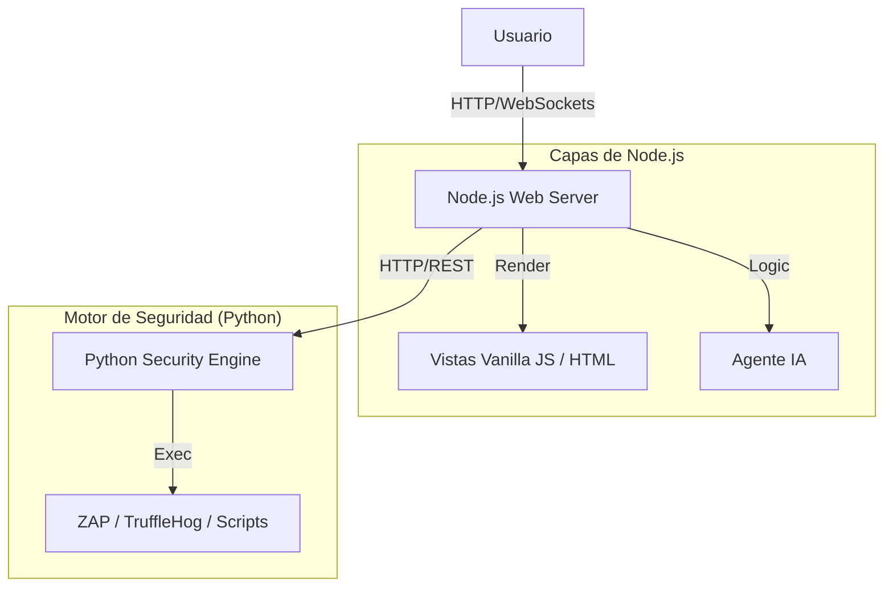

# 🏗️ Arquitectura Refinada: Node.js First & Python Worker

Este documento formaliza la evolución de la arquitectura SASK hacia un enfoque centrado en Node.js como orquestador principal y Python como motor especializado de seguridad.

## 1. Principios de Diseño
La arquitectura se reestructura para maximizar la interactividad de la interfaz y la estabilidad de los procesos de auditoría.

*   **Node.js como Orquestador (BFF):** El servidor Node.js maneja la interfaz de usuario, la gestión de sesiones y la integración con agentes de IA. Es el punto de entrada único para el usuario.
*   **Python como Worker Especializado:** El backend de Python se convierte en un microservicio interno (API o Worker) dedicado exclusivamente a ejecutar tareas pesadas de seguridad (escaneos, scripts de sistema).
*   **Desacoplamiento:** La caída de un script de seguridad en Python no afecta la disponibilidad de la interfaz web en Node.js.

## 2. Diagrama de Componentes



## 3. Estructura de Directorios Propuesta

```text
/sask-root
├── /web-server (Node.js)      # Orquestador Principal
│   ├── /public                # Assets estáticos (CSS, JS cliente)
│   ├── /views                 # Plantillas HTML (EJS/Pug/Vanilla)
│   ├── /src                   # Lógica de servidor
│   │   ├── /services          # Integración con IA y Python
│   │   └── /routes            # Endpoints de la UI
│   └── package.json
│
├── /security-engine (Python)  # Motor de Seguridad
│   ├── /scripts               # Wrappers para herramientas (ZAP, etc.)
│   ├── main.py                # API interna (FastAPI) para recibir órdenes
│   └── requirements.txt
│
└── /docs                      # Documentación del proyecto
```

## 4. Flujo de Datos Típico (Ej: Auditoría)
1.  **Inicio:** Usuario solicita "Auditoría Rápida" desde la interfaz web (Node.js).
2.  **Procesamiento:** Node.js registra la solicitud y llama al endpoint `/scan` del motor Python.
3.  **Ejecución:** Python lanza el script de seguridad en un subproceso aislado.
4.  **Feedback:** Python notifica el progreso o finalización a Node.js.
5.  **Inteligencia:** Node.js recibe los resultados crudos JSON, se los pasa al Agente IA para análisis y presenta el reporte humano al usuario.
